# Chapter 4: UML Diagrams

Introduces UML diagrams, including class diagrams and sequence diagrams with real examples.

# UML — Rules & Definitions

## 1. UML Definition

**UML (Unified Modeling Language)** is a standard visual modeling language used to represent the **structure, relationships, and interactions** of a software system.

UML helps us visualize a system before or while implementing it in code.

---

# 2. Class Diagram

### Definition

A **Class Diagram** represents the static structure of a system.

It shows:

- Classes
- Attributes / Variables
- Methods
- Relationships between classes

### Basic Structure

```text
┌──────────────────────┐
│      ClassName       │
├──────────────────────┤
│ - attribute : Type   │
│ - attribute : Type   │
├──────────────────────┤
│ + method() : Type    │
│ + method() : Type    │
└──────────────────────┘
```

### Visibility Symbols

| Symbol | Meaning |
|---|---|
| `+` | Public |
| `-` | Private |
| `#` | Protected |

---

# 3. Association

### Definition

**Association** represents a general relationship between two classes/objects.

```text
Class A ───────── Class B
```

### Rule

> Association simply means that two classes are related or communicate with each other.

### Example

```text
Driver ───────── Car
```

A `Driver` is associated with a `Car`.

---

# 4. Inheritance

### Definition

**Inheritance** represents an **IS-A relationship** between a parent class and a child class.

### Rule

> If Class B inherits from Class A, then **B IS-A A**.

```text
        Parent
          ▲
          │
        Child
```

### Example

```text
        Animal
           ▲
           │
          Cat
```

```text
Cat IS-A Animal
```

### Important Rule

The child class:

- Inherits properties/behaviours of the parent.
- Can add its own properties/behaviours.
- Can use accessible methods and attributes of the parent.

### Code Representation

```cpp
class B : public A {
};
```

---

# 5. Aggregation

### Definition

**Aggregation** represents a **weak HAS-A relationship** between classes.

It is represented by a **hollow diamond**.

```text
Class A ◇──────── Class B
```

### Rule

> In aggregation, the contained object can exist independently of the container.

### Example

```text
Team ◇──────── Player
```

A `Team` has `Player` objects, but a `Player` can exist independently.

### Key Point

```text
Aggregation
     ↓
Weak HAS-A
     ↓
Independent lifecycle
```

---

# 6. Composition

### Definition

**Composition** represents a **strong HAS-A relationship** between classes.

It is represented by a **filled diamond**.

```text
Class A ◆──────── Class B
```

### Rule

> In composition, the contained object's lifecycle is strongly dependent on the container/owner.

### Example

```text
Car ◆──────── Engine
```

A `Car` contains an `Engine`.

### Key Point

```text
Composition
     ↓
Strong HAS-A
     ↓
Dependent lifecycle
```

---

# 7. Association vs Aggregation vs Composition

```text
Association
     ↓
General relationship

Aggregation
     ↓
Weak HAS-A

Composition
     ↓
Strong HAS-A
```

### Symbols

```text
Association   : ─────────

Aggregation   : ◇────────

Composition   : ◆────────

Inheritance   : ────────▷
```

---

# 8. Sequence Diagram

### Definition

A **Sequence Diagram** represents the **interaction/communication between objects in a particular sequence over time**.

It mainly shows:

- Objects
- Lifelines
- Messages
- Order of execution
- Object creation
- Object destruction

### Important Rule

> Time progresses from **top to bottom** in a sequence diagram.

```text
Object A          Object B
   │                 │
   │──── message ───>│
   │                 │
   │<──── response ──│
   │                 │
```

---

# 9. Object

### Definition

An **object** is an instance participating in the interaction.

Example:

```text
User
ATM
Account
Transaction
```

Objects are generally placed at the top of a sequence diagram.

---

# 10. Lifeline

### Definition

A **lifeline** represents the existence of an object over time.

```text
Object
  │
  │
  │
  │
```

The vertical line represents the object's lifetime during the interaction.

---

# 11. Message

### Definition

A **message** represents communication between two objects.

```text
A ── message() ──▶ B
```

Example:

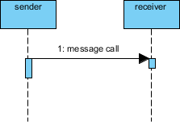

The filled arrowhead represents a synchronous operation call.

---

# 12. Synchronous Message

### Definition

A **synchronous message** is usually an operation call where the sender waits for the receiver to complete the operation before continuing.

```text
A ─────────▶ B
```

### UML Notation

- Solid line with a **filled arrowhead**.
- Usually represents a method or operation call.
- The receiver processes the call before the sender continues.

Example:


The sender waits while the receiver processes the operation.

### Rule

```text
Send request
     ↓
Wait for response
     ↓
Continue execution
```

---

# 13. Asynchronous Message

### Definition

An **asynchronous message** means the sender sends the message and continues without waiting for the receiver to complete the operation.

```text
A ─────────▷ B
```

### UML Notation

- Solid line with an **open arrowhead**.
- The receiver may process the message independently.
- A signal is an asynchronous message that does not expect a reply.

Example:

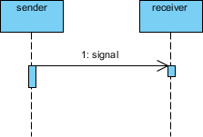

The open arrowhead represents an asynchronous signal. The sender continues without waiting.

### Rule

```text
Send request
     ↓
Continue execution
```

### Synchronous vs Asynchronous

| Message type | Line and arrowhead | Sender behavior | Typical example |
|---|---|---|---|
| Synchronous | Solid line with filled arrowhead | Waits for completion or a response | `verifyAccount()` |
| Asynchronous | Solid line with open arrowhead | Continues immediately | `publishEmail()` |
| Return | Dashed line with open arrowhead | Sends the result back | `accountVerified` |

> Do not use a dashed line to represent an asynchronous message. In UML, a dashed line with an open arrowhead represents a return message.

Return example:

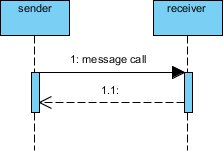

The dashed line with an open arrowhead represents the response returned by the receiver.

Reference: [Visual Paradigm sequence diagram messages](https://www.visual-paradigm.com/learning/handbooks/software-design-handbook/sequence-diagram.jsp)

### Complete Message Flow

The following flow shows a synchronous request, its response, and an asynchronous message:

```text
ATM                  Account              NotificationQueue
 │                      │                         │
 │── verifyAccount() ──▶│                         │
 │                      │                         │
 │◁ - - accountVerified - -│                      │
 │                      │                         │
 │── publishReceipt() ──────────────────────────▷│
 │                      │                         │
 │   continues without waiting                  │
```

In this flow:

1. `ATM` sends `verifyAccount()` synchronously and waits for `Account`.
2. `Account` returns `accountVerified` using a dashed line with an open arrowhead.
3. `ATM` sends `publishReceipt()` asynchronously to `NotificationQueue` and continues immediately.

---

# 14. Activation

### Definition

An **activation bar** represents the period during which an object is actively executing an operation.

```text
A
│
│ ┌───┐
│ │   │
│ │   │
│ └───┘
│
```

---

# 15. Create Message

### Definition

A **Create Message** represents the creation of an object during an interaction.

```text
A ─────────> B
             │
             │
```

The lifeline of `B` starts when it is created.

---

# 16. Destroy Message

### Definition

A **Destroy Message** represents the destruction/end of an object's lifetime.

The object is commonly shown with an `X` at the end of its lifeline.

```text
A ─────────> B
             │
             X
```

---

# 17. Combined Fragments

Sequence diagrams can use **combined fragments** to represent conditions and repetition.

Important operators:

- `alt`
- `opt`
- `loop`

---

# 18. alt

### Definition

`alt` represents **alternative flows**, similar to `if-else`.

### Rule

> Only one of the alternative branches is executed depending on the condition.

```text
alt
├── [condition 1]
│      operation 1
│
└── [condition 2]
       operation 2
```

### Example

```text
alt

[PIN correct]
    → Allow transaction

[PIN incorrect]
    → Reject transaction
```

---

# 19. opt

### Definition

`opt` represents an **optional flow**, similar to an `if` statement.

### Rule

> The operation is executed only when the condition is true.

```text
opt
└── [condition]
       operation
```

Example:

```text
opt [Account has balance]
    → Withdraw money
```

---

# 20. loop

### Definition

`loop` represents a **repeated interaction**, similar to a `for` or `while` loop.

### Rule

> The operations inside the loop are executed repeatedly while the condition allows it.

```text
loop [condition]
    operation
```

Example:

```text
loop [for each item]
    Process item
```

---

# 21. ATM Transaction Flow

The UML notes use an ATM transaction as an example.

### Main Objects

```text
User
ATM
Transaction
Account
Cash Dispenser
```

### Basic Flow

```text
1. Verify ATM PIN
2. Verify Account
3. Verify/Check Amount
4. Perform Transaction
5. Tell Cash Dispenser to dispense money
```

### Sequence

```text
User
  │
  ▼
 ATM
  │
  ▼
Transaction
  │
  ▼
Account
  │
  ▼
Cash Dispenser
```

---

# 22. UML Quick Revision Table

| Concept | Definition | Key Rule |
|---|---|---|
| **Class Diagram** | Shows static structure | Classes + attributes + methods + relationships |
| **Association** | General relationship | Classes are related |
| **Inheritance** | Parent-child relationship | **IS-A** |
| **Aggregation** | Weak ownership | **Weak HAS-A** |
| **Composition** | Strong ownership | **Strong HAS-A** |
| **Sequence Diagram** | Shows object interaction over time | Time → top to bottom |
| **Lifeline** | Object's existence over time | Vertical line |
| **Message** | Communication between objects | Object → Object |
| **Activation** | Period of active execution | Activation bar |
| **Synchronous** | Sender waits | Request → wait → response |
| **Asynchronous** | Sender doesn't wait | Request → continue |
| **Create** | Creates an object | Lifeline starts |
| **Destroy** | Destroys an object | Lifeline ends |
| **alt** | Alternatives | `if-else` |
| **opt** | Optional flow | `if` |
| **loop** | Repetition | `for/while` |

---

# 23. Most Important UML Rules

```text
Inheritance
     ↓
IS-A
     ↓
Child inherits from Parent


Aggregation
     ↓
Weak HAS-A
     ↓
Independent lifecycle


Composition
     ↓
Strong HAS-A
     ↓
Dependent lifecycle


Association
     ↓
General relationship


Sequence Diagram
     ↓
Interaction between objects
     ↓
Time moves top → bottom


alt
     ↓
if-else


opt
     ↓
if


loop
     ↓
for / while
```

# One-Line Memory Trick

```text
IS-A        → Inheritance
HAS-A Weak  → Aggregation
HAS-A Strong→ Composition
General     → Association

alt         → if-else
opt         → if
loop        → for/while
```


# UML Diagrams

## 1. Class Diagram Architecture

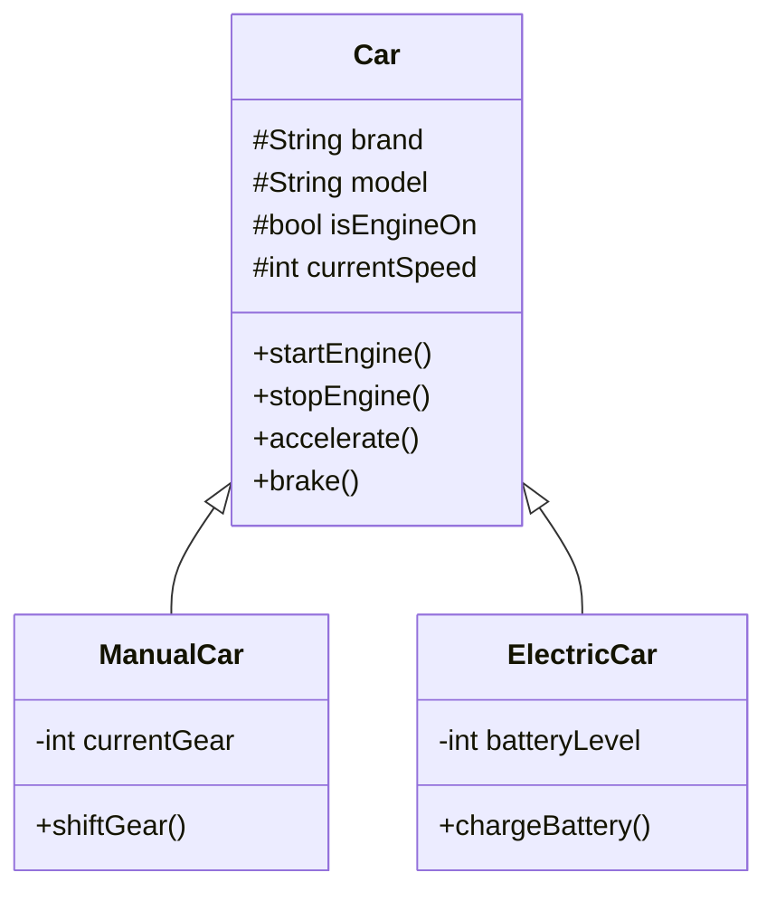

### Architecture

```text
                    ┌─────────────────────┐
                    │        Car          │
                    ├─────────────────────┤
                    │ # brand             │
                    │ # model             │
                    │ # isEngineOn        │
                    │ # currentSpeed      │
                    ├─────────────────────┤
                    │ + startEngine()     │
                    │ + stopEngine()      │
                    │ + accelerate()      │
                    │ + brake()           │
                    └──────────┬──────────┘
                               │
                    ┌──────────┴──────────┐
                    │                     │
          ┌─────────▼─────────┐  ┌────────▼─────────┐
          │    ManualCar      │  │   ElectricCar    │
          ├───────────────────┤  ├──────────────────┤
          │ - currentGear     │  │ - batteryLevel   │
          ├───────────────────┤  ├──────────────────┤
          │ + shiftGear()     │  │ + chargeBattery()│
          └───────────────────┘  └──────────────────┘
```

---

# 2. UML Relationships Architecture

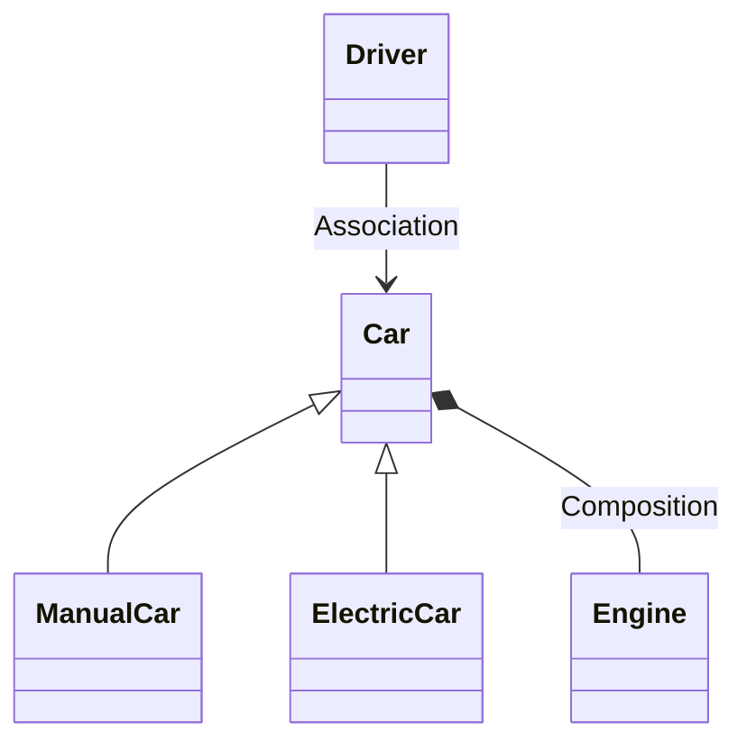

### Relationship Structure

```text
                     Inheritance
                 ┌────────────────┐
                 │      Car       │
                 └───────┬────────┘
                         │
              ┌──────────┴──────────┐
              │                     │
       ┌──────▼──────┐       ┌──────▼───────┐
       │  ManualCar  │       │ ElectricCar  │
       └─────────────┘       └──────────────┘


       Composition
       ┌─────────────┐      ◆─────────────┐
       │     Car     │────────────────────│ Engine
       └─────────────┘                    └────────

       Association
       ┌─────────────┐      ──────────────┐
       │   Driver    │────────────────────│ Car
       └─────────────┘                    └────────
```

---

# 3. Association

Association represents a general relationship between classes.

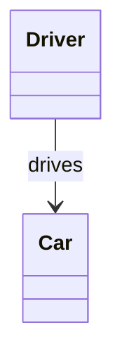

```text
┌─────────────┐              ┌─────────────┐
│   Driver    │─────────────▶│     Car     │
└─────────────┘    drives    └─────────────┘
```

### Key Point

```text
Association
     ↓
General relationship
```

---

# 4. Aggregation

Aggregation represents a **weak HAS-A relationship**.

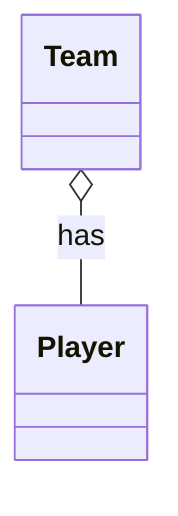

```text
┌─────────────┐       ◇──────────────┐
│    Team     │──────────────────────│ Player
└─────────────┘                      └────────
       Weak HAS-A relationship
```

### Key Point

```text
Aggregation
     ↓
Weak HAS-A
     ↓
Child can exist independently
```

---

# 5. Composition

Composition represents a **strong HAS-A relationship**.

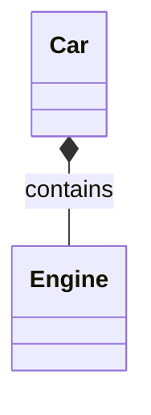

```text
┌─────────────┐       ◆──────────────┐
│     Car     │──────────────────────│ Engine
└─────────────┘                      └────────
       Strong HAS-A relationship
```

### Key Point

```text
Composition
     ↓
Strong HAS-A
     ↓
Contained object's lifecycle is strongly tied
to the owner
```

---

# 6. Inheritance

Inheritance represents an **IS-A relationship**.

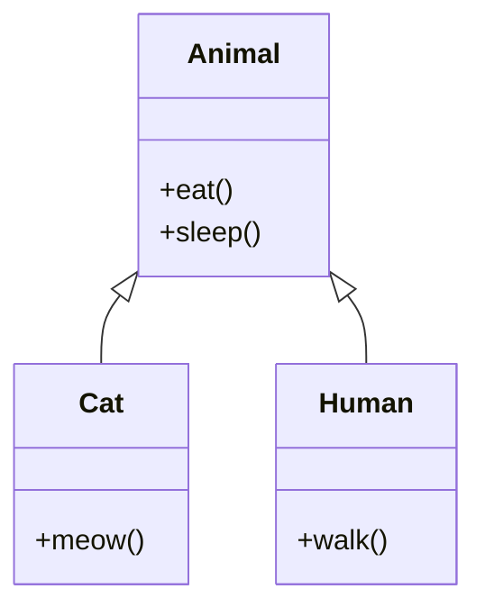

```text
                 ┌─────────────┐
                 │   Animal    │
                 ├─────────────┤
                 │ + eat()     │
                 │ + sleep()   │
                 └──────┬──────┘
                        │
                 ┌──────┴──────┐
                 │             │
          ┌──────▼─────┐ ┌─────▼──────┐
          │    Cat     │ │   Human    │
          ├────────────┤ ├─────────────┤
          │ + meow()   │ │ + walk()    │
          └────────────┘ └─────────────┘
```

```text
Cat IS-A Animal
Human IS-A Animal
```

---

# 7. Sequence Diagram Architecture

A Sequence Diagram shows **communication/interaction between objects over time**.

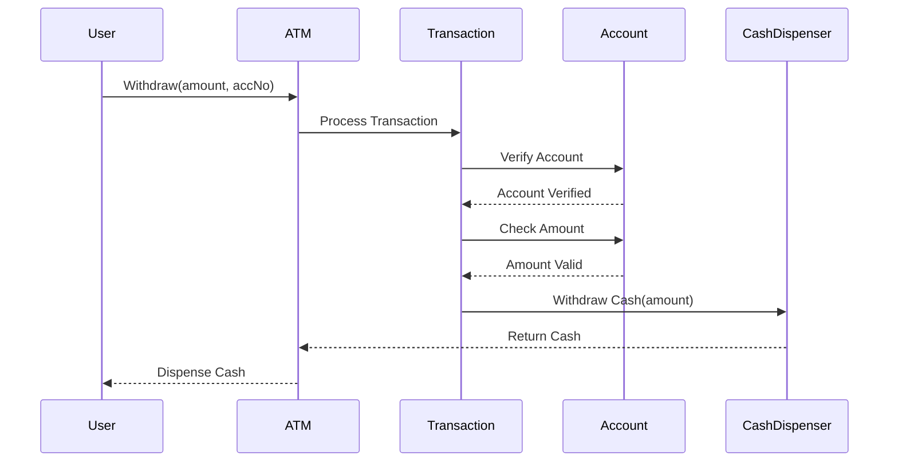

### Flow

```text
User
  │
  │ Withdraw(amount, accNo)
  ▼
 ATM
  │
  │ Process Transaction
  ▼
Transaction
  │
  │ Verify Account
  ▼
Account
  │
  │ Account Verified
  ▼
Transaction
  │
  │ Withdraw Cash
  ▼
Cash Dispenser
  │
  │ Return Cash
  ▼
 ATM
  │
  │ Dispense Cash
  ▼
User
```

---

# 8. ATM Transaction Sequence

The transaction flow can be represented as:

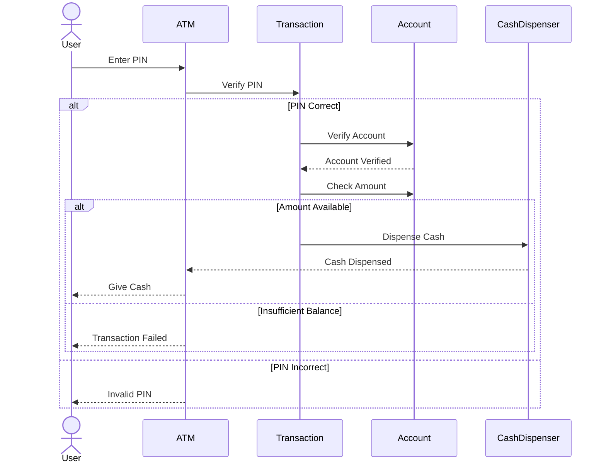

---

# 9. Sequence Diagram — Combined Fragments

## alt

Used for **if-else / alternative conditions**.

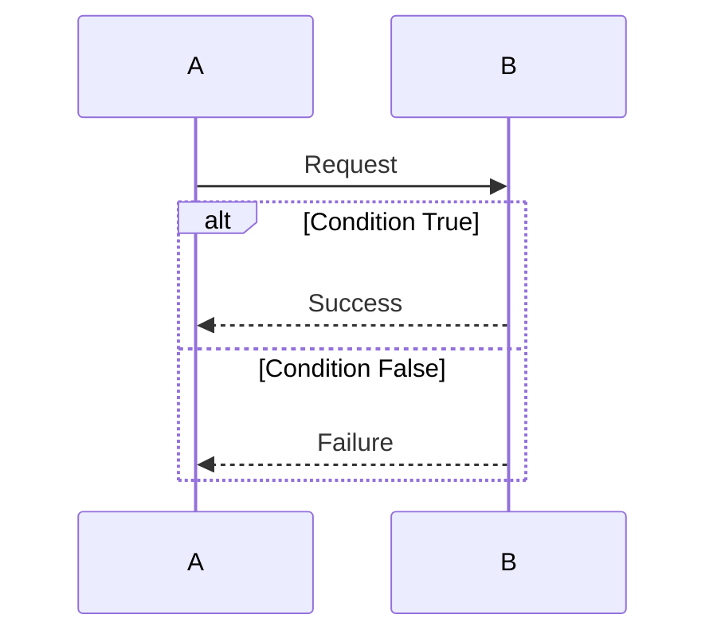

```text
alt
├── [condition 1]
│      operation 1
│
└── [condition 2]
       operation 2
```

---

## opt

Used for an **optional operation**, similar to an `if`.

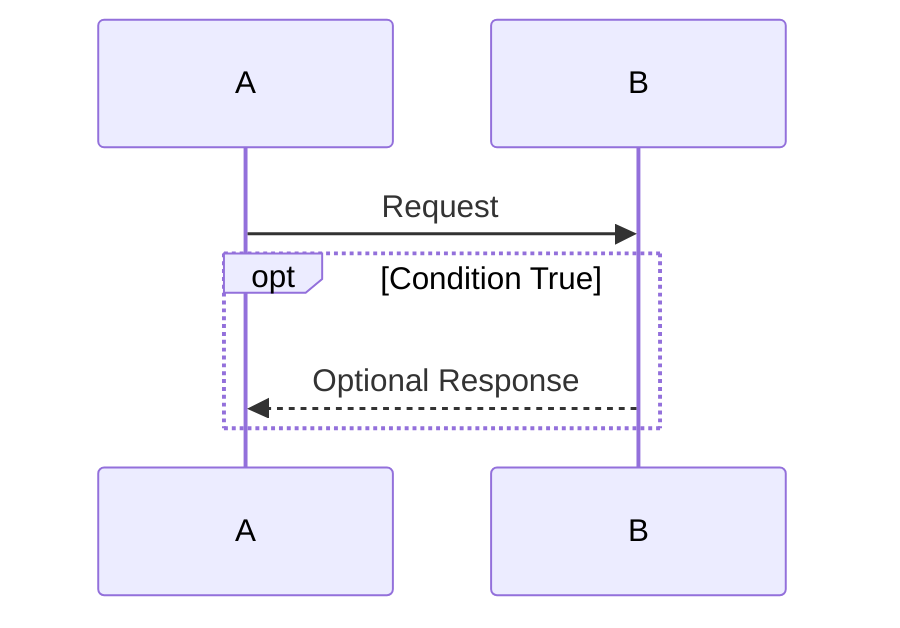

```text
opt
└── [condition]
       operation
```

---

## loop

Used for **repeated operations**, such as `for` or `while`.

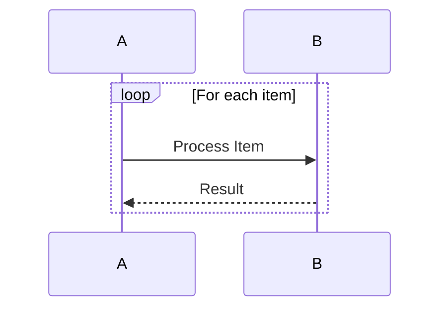

```text
loop
└── [condition]
       operation
       operation
       operation
```

---

# 10. UML Relationship Quick Architecture

```text
                         UML
                          │
          ┌───────────────┴───────────────┐
          │                               │
    Class Diagram                  Sequence Diagram
          │                               │
          │                               ├── Objects
          │                               ├── Lifeline
          │                               ├── Messages
          │                               ├── Activation
          │                               ├── Sync
          │                               ├── Async
          │                               ├── Create
          │                               └── Destroy
          │
          └── Relationships
                  │
       ┌──────────┼──────────┬───────────┐
       │          │          │           │
 Association Aggregation Composition Inheritance
       │          │          │           │
   General      Weak       Strong       IS-A
 relationship   HAS-A      HAS-A
```

# Quick Revision

| Relationship | Meaning | UML Symbol |
|---|---|---|
| Association | General relationship | `───>` |
| Aggregation | Weak HAS-A | `◇───` |
| Composition | Strong HAS-A | `◆───` |
| Inheritance | IS-A | `△` |

| Sequence Fragment | Meaning |
|---|---|
| `alt` | If-else / alternatives |
| `opt` | Optional / if |
| `loop` | Repetition / for / while |

[Back to the course index](../README.md)
